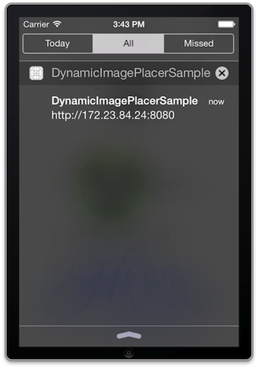
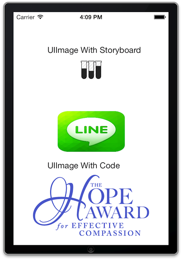

# DynamicImagePlacer

DynamicImagePlacer is a Library for iOS developer and designer for simply replace the image files in resource bundle without rebuild the app.

Supports iOS 6+

## Background

After doing serveral application projects in a team, I find that some basic facts of team co-working between application developer and UI/UX designer.

- They are both busy. Developer are focusing on layout creation, feature implementation, bug fix, etc. While designers focus on the colors, pixels, size, or something else.
- For certain kinds of image resources of an iOS application (Navigation Item Image, Tabbar Item Image, Toolbar Item Image, View Background Image, etc.), the sizes of these images are fixed or can be fixed at the very early time in the project.
- Developers always use some "SELF FOUND IMAGES" to fit the icon components first. 
- Designers want to see their parts used in the application as soon as possible after they made a minor change. (May be an color change or 1 pixel change)
- Developers are working on some temple branch, even can not get current code base compiled, they are lazy to change to the version that is installed in designer's device. So they think maybe designers can replace the images theirselves.
- Designers refuse to learn how to use Xcode, they even do not download it.

So here comes the **DynamicImagePlacer** idea, with which

1. Developers will not work for designers on only changing the image files.
2. Designers will be able to use an iOS with developing application installed and replace the images to see the effects.

## Fundemental

Slightly use some techniques like [Runtime Method Swizzling](http://cocoadev.com/MethodSwizzling) and setting up an iOS webserver.

 1. Use runtime method swizzling to hool UIImage native implementation.
 2. Set up webserver to interact with developer/designers.
 3. Designer upload the image for replacement and the webserver store images into application's document directory with same name of the original images.
 4. When application get restart, code/Storyboard/Xib usage of the original image in resource bundle will be replaced with the replacement version image in the docuemtn directory.
 
 So you should better disintegrate DynamicImagePlacer in the build in case you will submit it to AppStore, although I have carefully written the macros to make sure the Runtime Method Swizzling code will not be included in release build, which also means you can not use the DynamicImagePlacer feature in Release build.

## Installation

- Add [DynamicImagePlacer](https://github.com/Angelbear/DynamicImagePlacer) to your project
- Add the files in the Source directory
- Install the libaries in the Support directory

### Installation with CocoaPods

[CocoaPods](http://cocoapods.org) is a dependency manager for Objective-C, which automates and simplifies the process of using 3rd-party libraries like AFNetworking in your projects. See the ["Getting Started" guide for more information](https://github.com/AFNetworking/AFNetworking/wiki/Getting-Started-with-AFNetworking).

#### Podfile
    platform :ios, '6.0'
    pod "DynamicImagePlacer", "~> 0.0.1"
    

## Usage

You can use DynamicImagePlacer in almost any type of iOS projects. For example, the Sample project is an simple project like below. It has an UIImageView and a UIButton whose image is set by Storyboard, and an UIImageView whose image is set by code.

You can just add one line code in your application:didFinishLaunchingWithOptions: delegate.

    - (BOOL)application:(UIApplication *)application didFinishLaunchingWithOptions:(NSDictionary *)launchOptions
    {
        [[DynamicImagePlacer sharedPlacer] startServer];
        return YES;
    }

1. After startServer is called, a webserver on port 8080 will be set up after DynamicImagePlacer start its process. Developer can use a computer in the same local network with target iOS device to access http://[ip]:8080/.
2. If you do not know the IP address, you can check the unread notification of the iOS device, DynamicImagePlacer should have pushed the message.  

3. On the webpage you can see all the icons (Exception app icon, default image) list and with white placeholders and related links.

4. You can drag the icon file in to the right of destination icon that you want to change

5. You can repeat 4 to replace the image you dragged in, or press delete link in the right of Replacement section to delete the image to let original image work.
6. After doing all the changes, you need to kill the app for once.
7. Restart the application, you will see your uploaded image is used.     
